<!-- HEADER SECTION -->
<div align="center">
  <br />
  <a href="#">
    
  </a>
  <br />
  <br />

  <h1 align="center">S O C I E T Y &nbsp; S Y N C</h1>
  <p align="center">
    <strong>A masterclass in residential management systems.</strong>
    <br />
    Elevating the standard of living through intelligent, frictionless technology.
  </p>

  <p align="center">
    
    
    
    
  </p>
</div>

<hr style="border: 1px solid #333;" />

## ❖ The Vision

Traditional society management is fundamentally broken—relying on fragmented ledgers, WhatsApp groups, and manual entry logs. **SocietySync** is the definitive answer. Engineered with an uncompromising focus on UX/UI and backend resilience, it serves as the central nervous system for modern residential complexes. 

From automated billing cycles to real-time security perimeters, SocietySync doesn't just manage a society; it orchestrates it.

<br />

## ❖ Comprehensive Role-Based Interfaces

The application features entirely distinct, purpose-built dashboards tailored to the specific needs of each user role. Below is a comprehensive visual tour of the platform's capabilities.

### 🏢 Admin Portal
**Capabilities:** The central command node. Admins can oversee treasury finances, manage residential data, configure society settings, and initiate democratic polls.

<table align="center" style="width: 100%; border: none; background: transparent;">
  <tr>
    <td width="50%" style="border: none; padding: 5px;">
      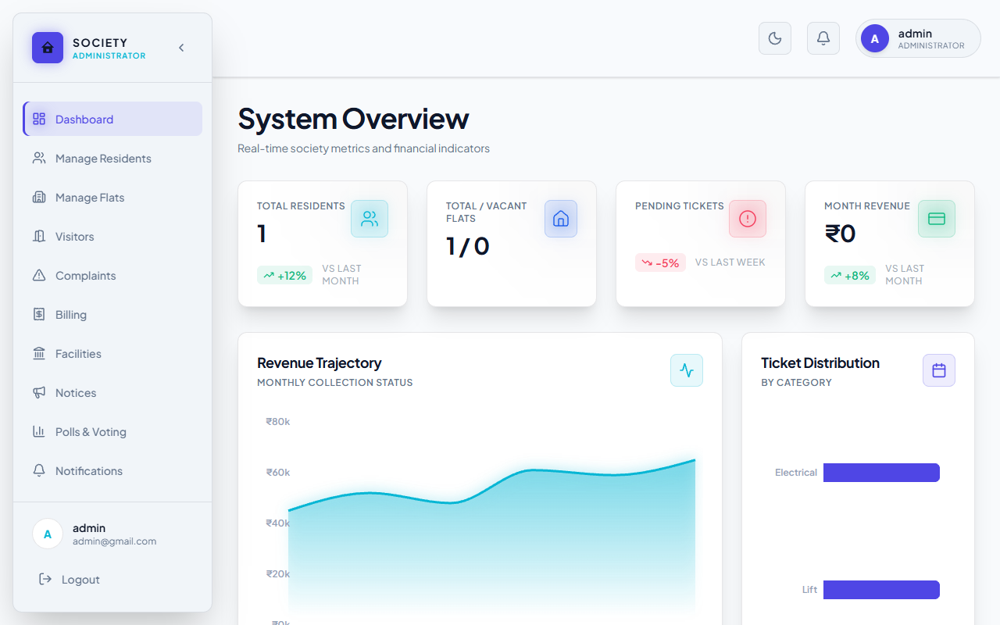
      <p align="center"><i>Master Dashboard Overview</i></p>
    </td>
    <td width="50%" style="border: none; padding: 5px;">
      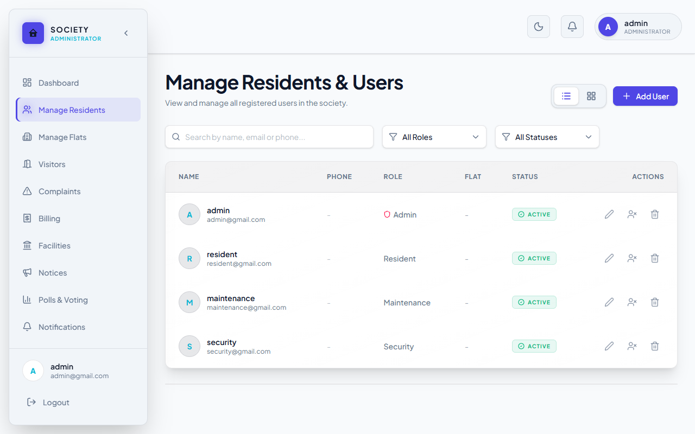
      <p align="center"><i>Resident Directory & Management</i></p>
    </td>
  </tr>
  <tr>
    <td width="50%" style="border: none; padding: 5px;">
      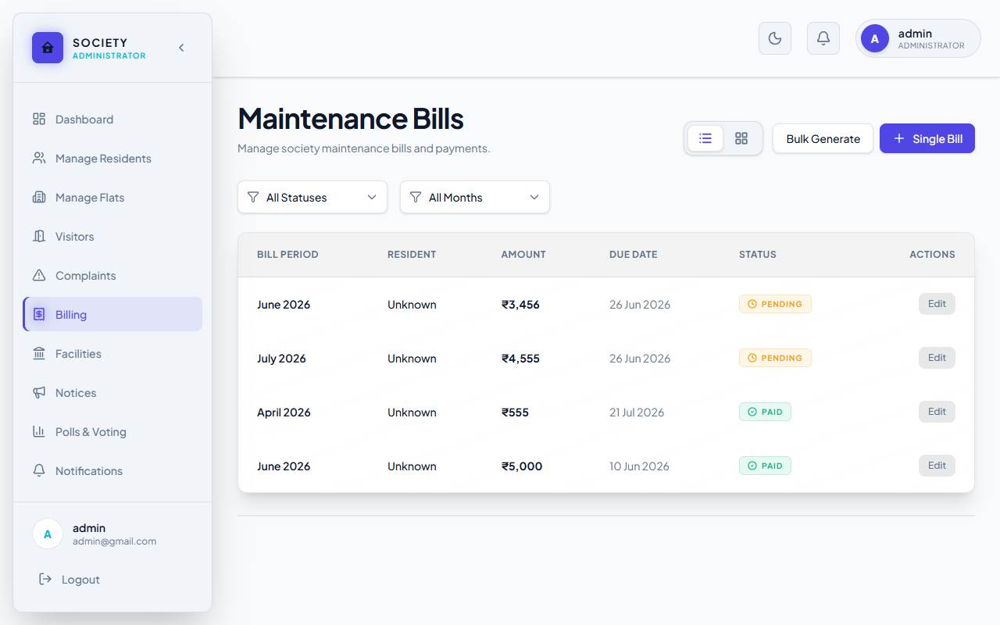
      <p align="center"><i>Automated Financial Billing</i></p>
    </td>
    <td width="50%" style="border: none; padding: 5px;">
      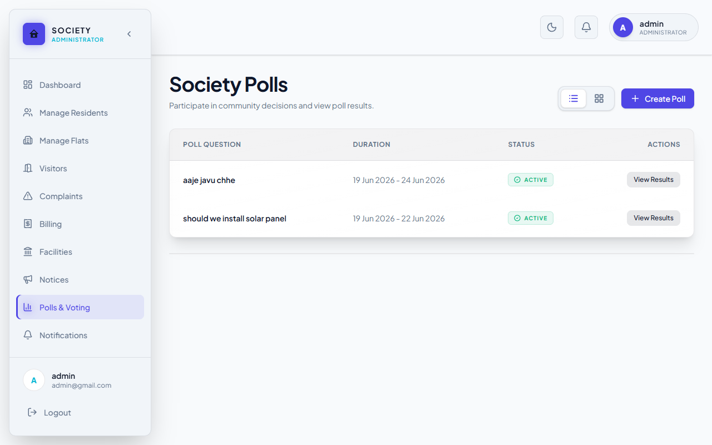
      <p align="center"><i>Democratic Society Polls</i></p>
    </td>
  </tr>
</table>

### 🏠 Resident Portal
**Capabilities:** A dedicated space for residents to pay maintenance bills, log facility complaints, pre-approve visitors to bypass security checks, and participate in society polls.

<table align="center" style="width: 100%; border: none; background: transparent;">
  <tr>
    <td width="50%" style="border: none; padding: 5px;">
      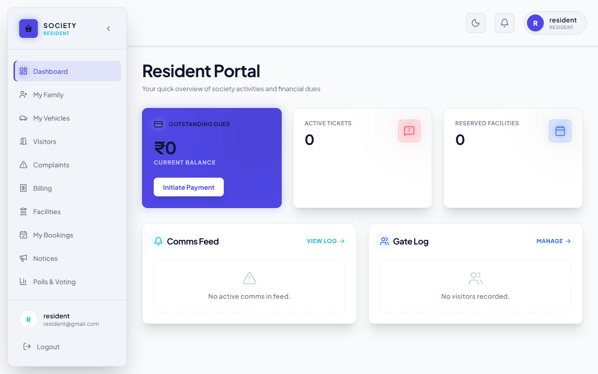
      <p align="center"><i>Personalized Resident Portal</i></p>
    </td>
    <td width="50%" style="border: none; padding: 5px;">
      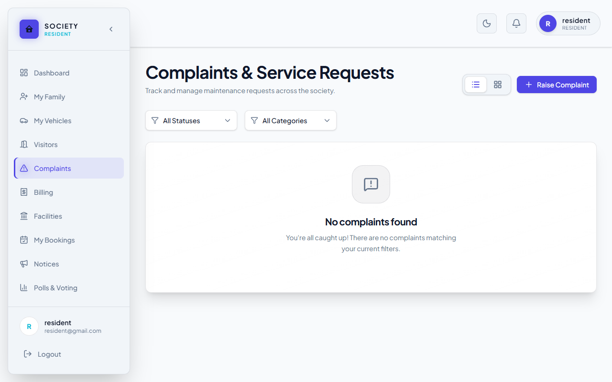
      <p align="center"><i>Complaints & Service Requests</i></p>
    </td>
  </tr>
  <tr>
    <td width="50%" style="border: none; padding: 5px;">
      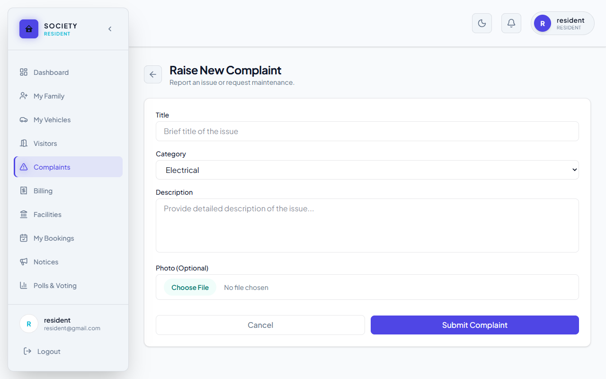
      <p align="center"><i>Log a New Facility Issue</i></p>
    </td>
    <td width="50%" style="border: none; padding: 5px;">
      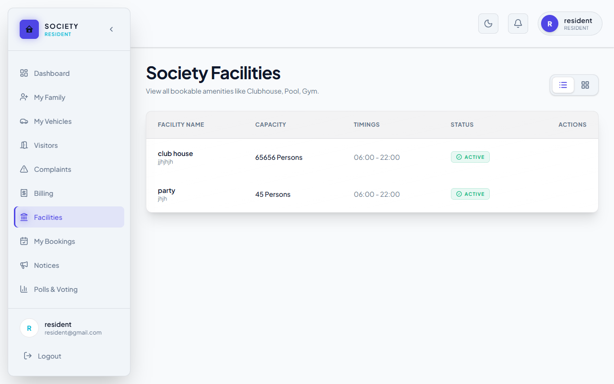
      <p align="center"><i>Clubhouse & Facility Bookings</i></p>
    </td>
  </tr>
</table>

### 🚨 Security Portal
**Capabilities:** A specialized interface for the security gate. Guards can log visitor entries and exits in real-time, view resident pre-approvals, and manage vehicle logs.

<table align="center" style="width: 100%; border: none; background: transparent;">
  <tr>
    <td width="50%" style="border: none; padding: 5px;">
      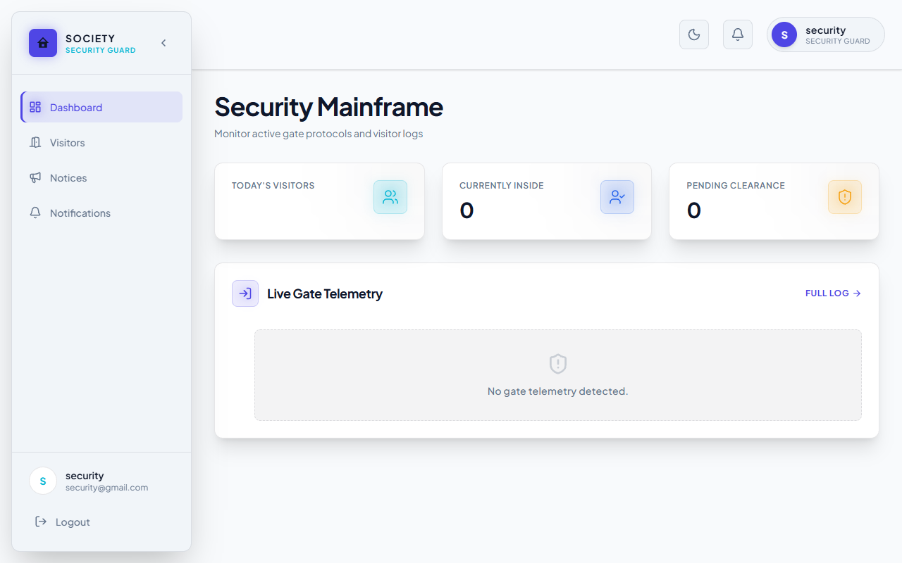
      <p align="center"><i>Security Mainframe</i></p>
    </td>
    <td width="50%" style="border: none; padding: 5px;">
      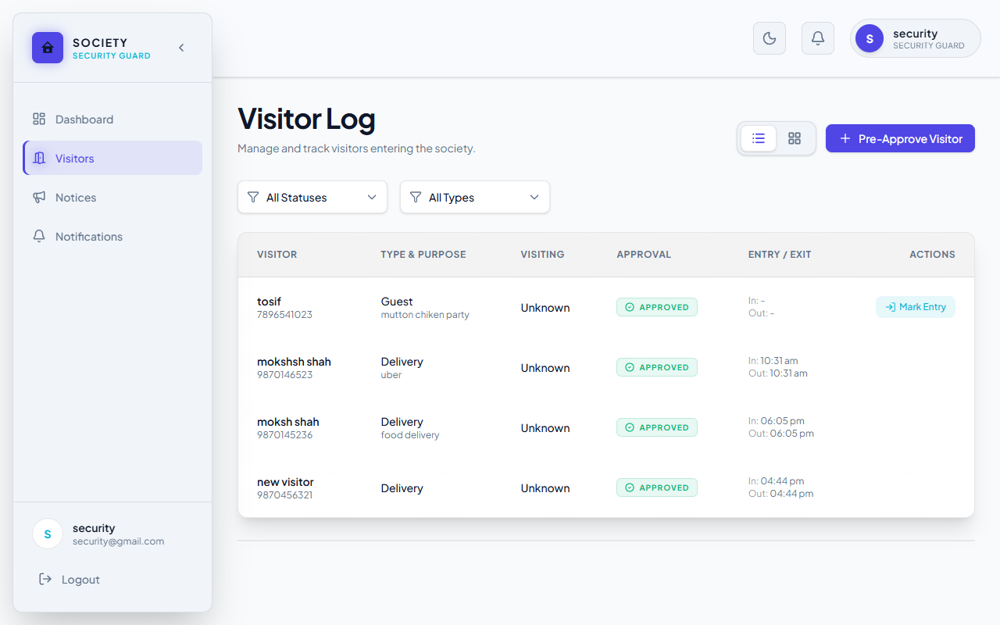
      <p align="center"><i>Real-time Visitor Log</i></p>
    </td>
  </tr>
  <tr>
    <td colspan="2" style="border: none; padding: 5px; text-align: center;">
      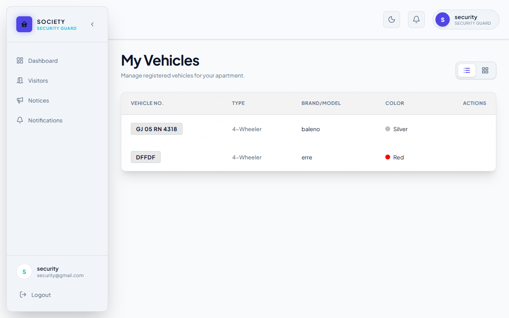
      <p align="center"><i>Registered Vehicle Tracking</i></p>
    </td>
  </tr>
</table>

### 🔧 Maintenance Portal
**Capabilities:** Focused view for service staff (plumbers, electricians). Staff members can view their assigned work orders, update the status, and mark complaints as resolved.

<table align="center" style="width: 100%; border: none; background: transparent;">
  <tr>
    <td width="50%" style="border: none; padding: 5px;">
      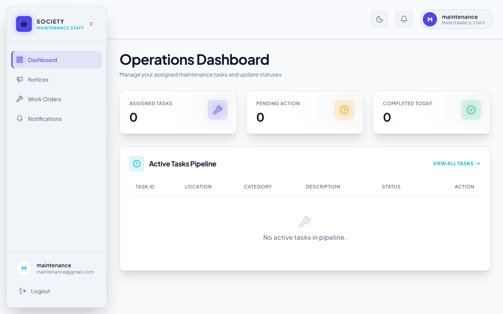
      <p align="center"><i>Operations Dashboard</i></p>
    </td>
    <td width="50%" style="border: none; padding: 5px;">
      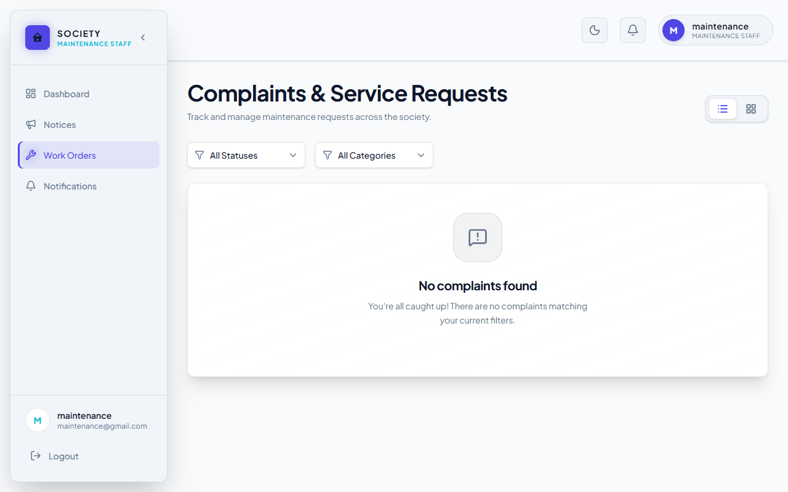
      <p align="center"><i>Active Work Orders</i></p>
    </td>
  </tr>
</table>

### 👤 Common Views & Authentication Flow
**Capabilities:** Universal pages shared across roles, and a sleek, animated login portal with a robust OTP-based "Forgot Password" integration.

<table align="center" style="width: 100%; border: none; background: transparent;">
  <tr>
    <td width="33%" style="border: none; padding: 5px;">
      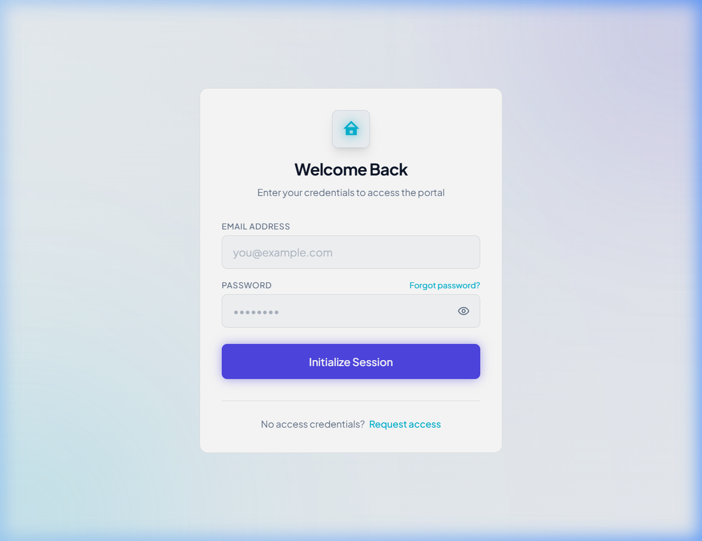
      <p align="center"><i>Secure Login Portal</i></p>
    </td>
    <td width="33%" style="border: none; padding: 5px;">
      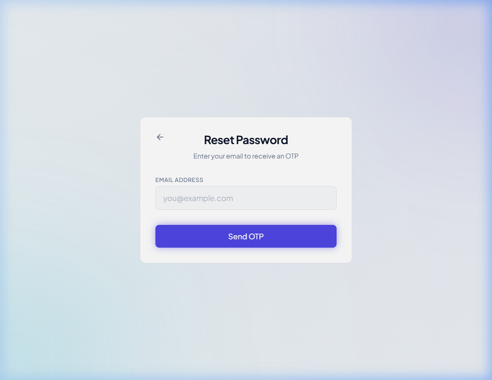
      <p align="center"><i>Account Recovery (OTP)</i></p>
    </td>
    <td width="33%" style="border: none; padding: 5px;">
      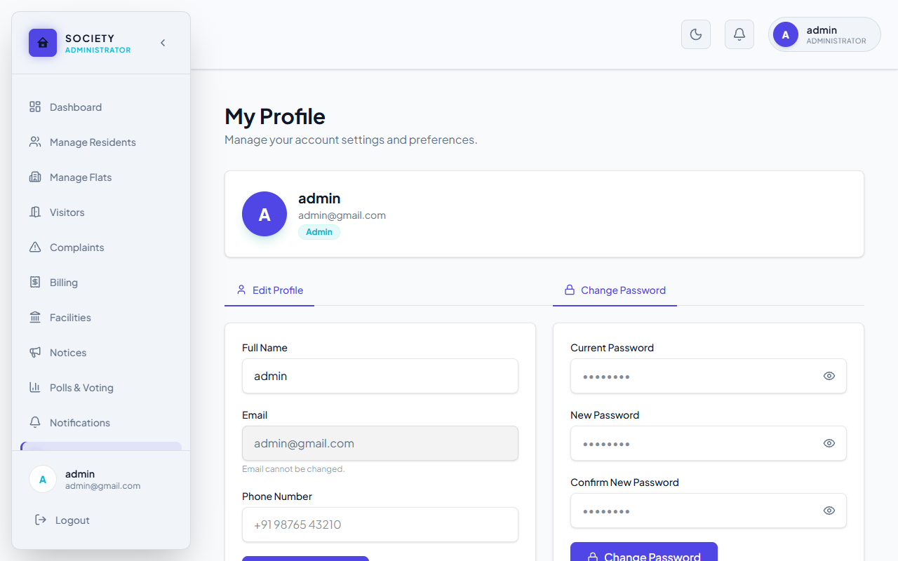
      <p align="center"><i>Universal User Profile</i></p>
    </td>
  </tr>
</table>

<br />

## ❖ Access the Live Demo

Experience the platform from every perspective. We have provisioned read-only environments for all user archetypes. Use the credentials below to authenticate:

| Personnel Tier  | Primary Directive |
| :--- | :--- |
| **System Admin** | Global oversight, financial controls, user administration. |
| **Maintenance Staff** | Work order fulfillment, ticket resolution, facility upkeep. |
| **Security Guard** | Entry/exit logging, vehicle scanning, perimeter alerts. |
| **Resident** | Bill payments, complaint registration, visitor pre-approvals. |

<br />

## ❖ Engineering & Architecture

This application is built with a strictly typed, modular architecture designed for high throughput and zero latency.

- **Client Layer:** Next.js, React 19, Framer Motion (Hardware-accelerated animations).
- **Styling Engine:** Tailwind CSS v4 featuring a custom Design System (Glassmorphism & Cyber-Dark themes).
- **Server Runtime:** Node.js paired with Express.js for a dedicated, microservice-ready API layer.
- **Data Persistence:** MongoDB via Mongoose, utilizing strict schemas and relational population.
- **Security:** JWT-based stateless authentication, Bcrypt payload hashing, and role-based route guards (RBAC).

<br />

## ❖ Local Deployment Protocol

To run this enterprise-grade environment on your local machine, execute the following sequence:

```bash
# 1. Initialize dependencies
npm install

# 2. Boot the Next.js development server
npm run dev
```
*The application environment will bind to `http://localhost:3000`.*

---
<div align="center">
  <p>Engineered with precision. Designed for scale.</p>
</div>
